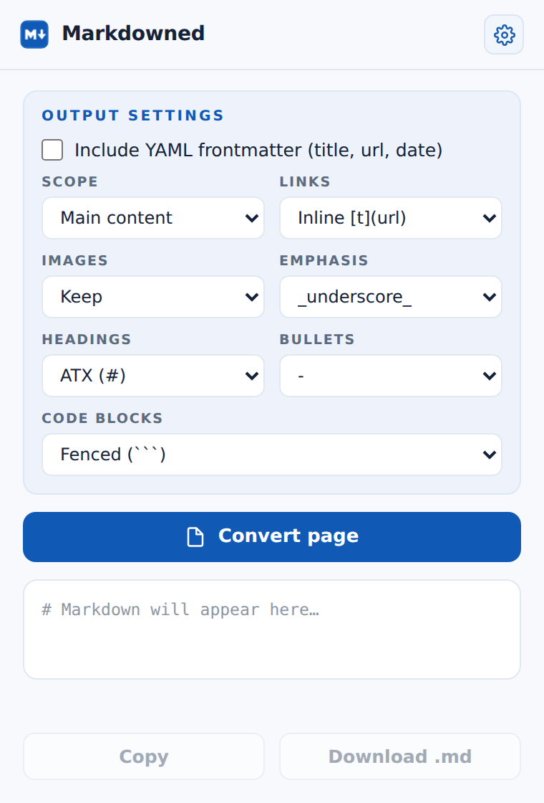

<div align="center">


# Markdowned

**Convert any web page to clean Markdown in one click.**

Markdowned is a Chrome extension that turns the page you're reading into
well-formed Markdown — with configurable output, smart content extraction,
GFM tables, and one-click copy or download. Everything runs on your device;
no data ever leaves the browser.

[Install](#installation) · [Features](#features) · [How it works](#how-it-works) · [Privacy](#privacy)



</div>

---

## Why

Copying a web page rarely gives you usable text: you get styling junk, broken
tables, relative links that point nowhere, and a pile of navigation and ads
around the actual content. Markdowned produces Markdown that survives being
pasted anywhere — into a note-taking app, a Git repo, a static site, or an
LLM prompt.

## Features

**Conversion quality**

- Headings, emphasis, links, lists, blockquotes, code blocks, and images with
  captions (`<figure>`/`<figcaption>`).
- **GFM tables** — real pipe tables with proper `\|` escaping, where most
  converters flatten tables into word soup.
- **Absolute URLs** — relative links and images are rewritten against the page
  URL, and lazy-loaded images (`data-src`) are resolved, so the output works
  wherever you paste it.
- The page title is added as an `# H1` only when the content doesn't already
  open with one — no duplicated titles.
- Same-origin iframe content is appended under an *Embedded content* section
  when accessible.

**Scope: full page or just the article**

- **Full page** (default) converts everything, minus scripts, styles, cookie
  banners, popups and other non-content junk.
- **Main content** runs a Readability-style scoring pass: containers are
  scored by the paragraphs they hold, link-heavy blocks (menus, "related
  articles" rails) are penalized by link density, and class/id hints
  (`article` vs `sidebar`) tip the balance. The result line shows how much of
  the page was kept (e.g. `main content · ~62% of page`).

**Configurable output** *(persists between sessions)*

| Setting | Options |
| --- | --- |
| Scope | Full page *(default)* / Main content |
| Links | Inline `[t](url)` / Referenced `[t][1]` / Strip (text only) |
| Images | Keep / Remove |
| Emphasis | `_underscore_` / `*asterisk*` |
| Headings | ATX `#` / Setext (underline) |
| Bullets | `-` / `*` / `+` |
| Code blocks | Fenced ``` / Indented |
| Frontmatter | Optional YAML block (title, url, date) |

*Strip links* and *Remove images* are handy when preparing text for an LLM —
you get clean prose without URL clutter.

**Workflow**

- **Copy** to clipboard or **Download** as a slugified `.md` file
  (`quantum-chips-arrive-2026-07-02.md`).
- Reopening the popup on the same page restores the last conversion instantly.
- Every step is timeout-bounded — a stuck page yields an error toast, never an
  endless spinner.

## Installation

Markdowned isn't on the Chrome Web Store yet. To run it locally:

1. Download or clone this repository.
2. Open `chrome://extensions` in Chrome (or any Chromium browser).
3. Enable **Developer mode** (top-right toggle).
4. Click **Load unpacked** and select the project folder.
5. Pin the icon to your toolbar, open any article, and hit **Convert page**.

> Works on Chrome 114+ and other Chromium-based browsers (Edge, Brave, etc.).

## How it works

1. **Extract** — when you click *Convert page*, a small scraper runs once in
   the active tab. It clones the page, strips non-content elements, picks the
   content region according to your scope setting, absolutizes every URL,
   fixes lazy-loaded images, and collects accessible iframe content.
2. **Convert** — the extracted HTML is converted in the popup with
   [Turndown](https://github.com/mixmark-io/turndown), extended with custom
   rules for GFM tables, figure captions, link stripping and image removal,
   using your output settings.
3. **Polish** — extra blank lines are collapsed and list markers are
   normalized before the result lands in the editor.

## Privacy

- **Zero network requests.** Conversion happens entirely on your device —
  no external servers, no analytics, no tracking. The extension doesn't even
  request host permissions.
- The page is only read when you click the button (`activeTab` + `scripting`);
  no content script runs in the background on every site.
- `storage` is used solely for your settings and the last conversion, kept
  locally in your browser.

## Project structure

```
markdowned/
├── manifest.json     # Manifest V3 configuration
├── popup.html        # Popup markup
├── popup.css         # Styles (#105AB6 palette)
├── popup.js          # Extraction, scoring, conversion, UI logic
├── js/turndown.js    # Turndown HTML→Markdown library
├── icons/            # Toolbar icons
└── docs/             # README assets
```

## Development

No build step — plain HTML, CSS, and JavaScript. The only dependency is the
bundled Turndown library. Edit the files, then reload the extension from
`chrome://extensions`.

## Related

Markdowned shares its design language with **Timestamped**, a publish-date
finder extension built the same way: Manifest V3, zero frameworks, minimal
permissions.

## License

Released under the [MIT License](LICENSE). Turndown is MIT-licensed by its
respective authors.
